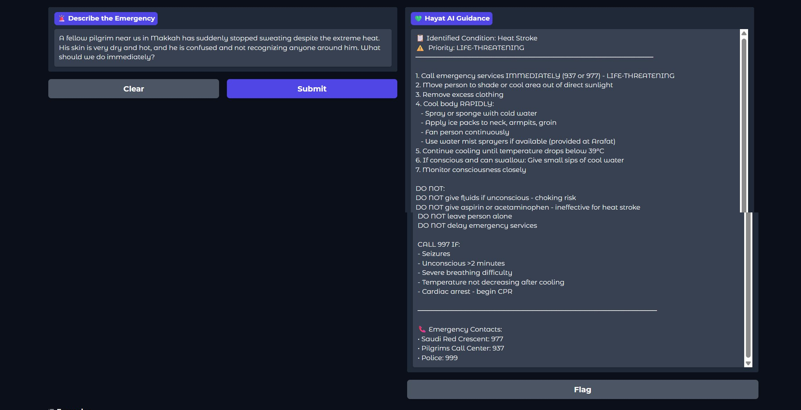
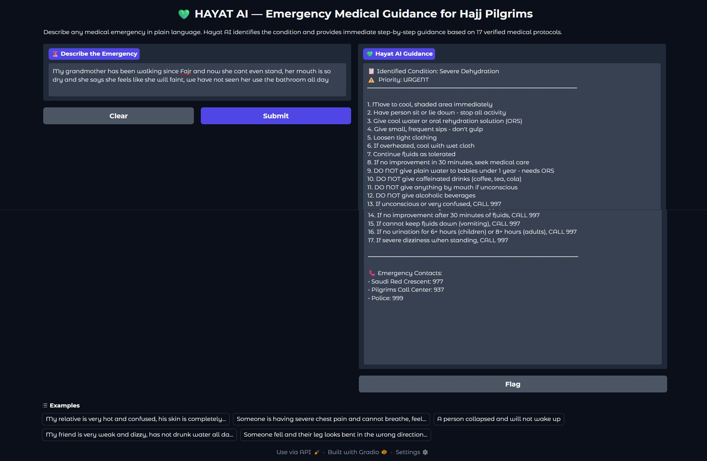
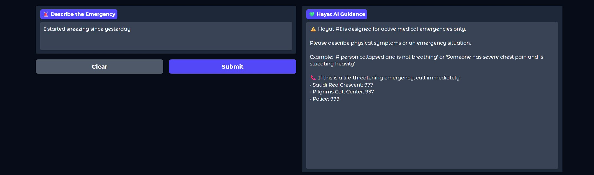
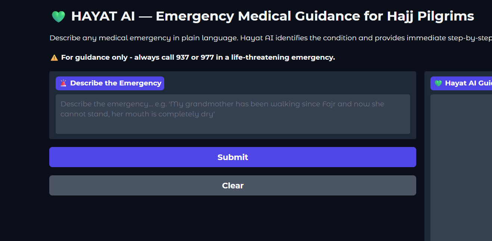
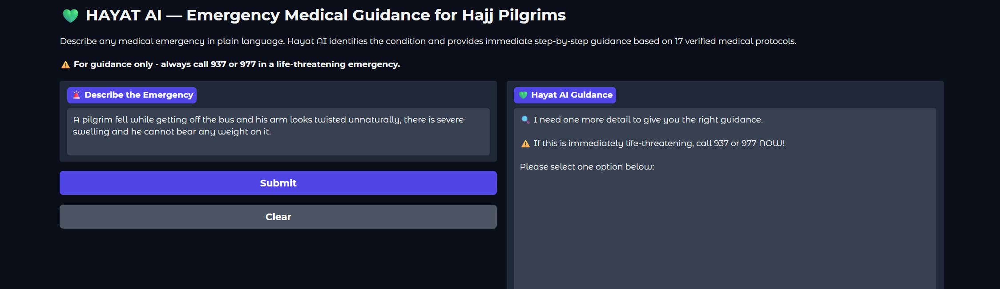
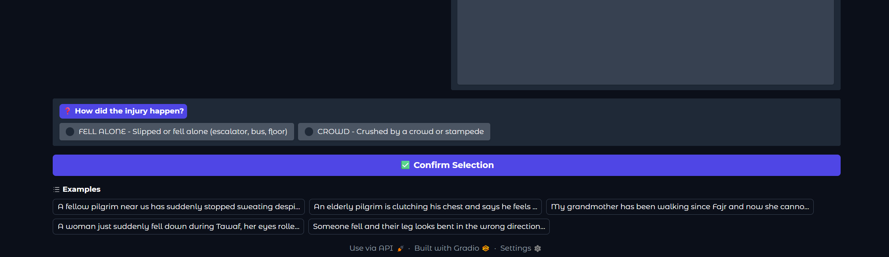
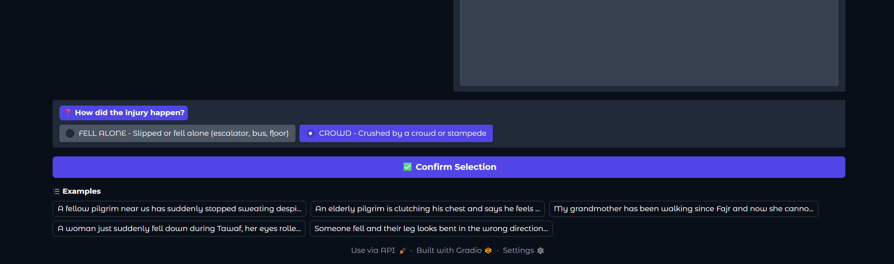
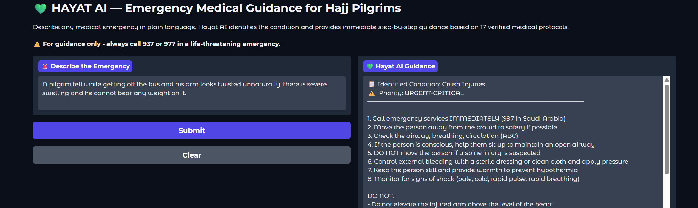
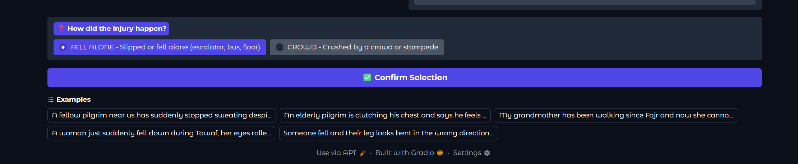
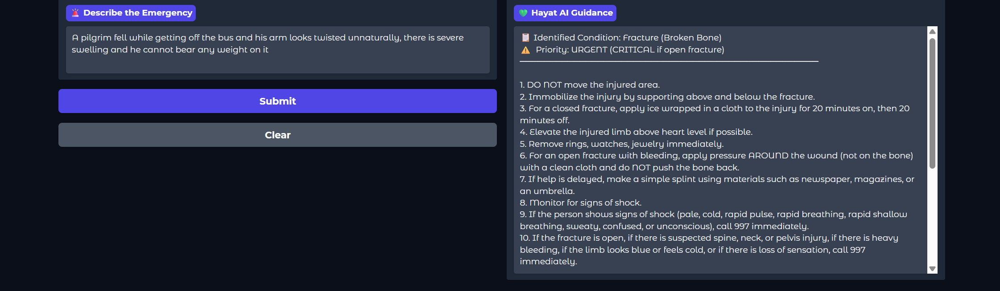

<div align="center">

<h1>💚 HAYAT AI</h1>
<h3>First-Response Emergency Medical Guidance System for Hajj and Umrah Pilgrims</h3>
<p>
A Retrieval-Augmented Generation (RAG) system designed to provide grounded first-response emergency medical guidance for Hajj and Umrah pilgrims during critical early moments.<br/>
Built with <b>sentence-transformers</b> + <b>FAISS</b> + <b>Mistral-7B-Instruct</b> (GitHub notebook) and <b>Llama 3.3 70B Versatile via Groq API</b> (live app).
</p>


</div>

---

> ⚠️ **Disclaimer:** Hayat AI is designed for guidance only and does not replace emergency medical services. Always call **937** (Pilgrims Call Center), **977** (Saudi Red Crescent), or **997** (Ambulance) in a life-threatening emergency.

---

## 🚀 Live App

**Try Hayat AI instantly - no setup required:**

👉 [**Launch Hayat AI**](https://huggingface.co/spaces/RomanaQureshi/Hayat-AI-Hajj-Medical-Emergency-Guidance)

> **Live app** uses Groq API with Llama 3.3 70B Versatile and contains **20 protocols from 9 verified sources**.
> **GitHub notebook** uses Mistral-7B-Instruct locally and contains the **original 17 protocols from 5 peer-reviewed papers** and Saudi Ministry of Health guidelines.

---

## 📋 Table of Contents

- [Overview](#overview)
- [Why Hayat AI](#why-hayat-ai)
- [System Architecture](#system-architecture)
- [Knowledge Base](#knowledge-base)
- [Demo](#demo)
- [Clarification Dialogue](#clarification-dialogue)
- [Evaluation](#evaluation)
- [Installation](#installation)
- [Sources](#sources)
- [Future Work](#future-work)
- [Citation & Copyright](#citation--copyright)
- [Author](#author)

---

## Overview

Hayat AI is a domain-specific RAG system built for Hajj and Umrah pilgrims and their companions. It identifies likely emergency medical conditions from natural language descriptions and provides structured, step-by-step first-response guidance grounded in peer-reviewed medical research.

The **GitHub notebook** covers the original **17 emergency protocols** including heat stroke, heart attack, severe dehydration, crush injuries, fractures, hypoglycemia, asthma attacks, and more — all conditions documented in published Hajj medical literature.

The **live deployed app** has been expanded to **20 protocols** with the addition of Head Injury, Severe Bleeding, and Burns, based on ANZCOR clinical guidelines and Cureus 2022 Hajj trauma research.

---

## Why Hayat AI

Every year millions of pilgrims from around the world gather in Makkah for Hajj. Medical emergencies are common:

- Temperatures exceed **55°C** in Arafat during summer Hajj (Rahman et al., 2017)
- Infectious diseases account for **53.26%** of all medical cases (Khan et al., 2018)
- Cardiovascular disease causes **45.8%** of deaths (Al Shimemeri, 2012)
- Crowd densities reach **12 people per square metre** near the Kaaba (Rahman et al., 2017)
- **49.3%** of pilgrims walk in direct sunlight instead of using available transport (Samarkandi et al., 2025)
- **51.7%** of pilgrims do not take prescribed medications during Hajj (Samarkandi et al., 2025)

In an emergency, pilgrims and their companions may need immediate guidance in plain language during those first critical moments before professional medical help fully takes over. Hayat AI is designed to help bridge this first-response gap.

---

## System Architecture

```
User Query (plain language emergency description)
        ↓
Input Validation (emergency keyword check)
        ↓
Sentence Embedding (all-MiniLM-L6-v2)
        ↓
FAISS Cosine Similarity Search (IndexFlatIP + normalized vectors)
        ↓
Score Difference Check
   ├── Confident match (diff > 0.06) → Generate Response directly
   └── Ambiguous (diff ≤ 0.06) → Clarification Dialogue
                                        ↓
                               Radio Button Question shown
                                        ↓
                               User selects one option
                                        ↓
                               More precise protocol selection supported
        ↓
Mistral-7B-Instruct (4-bit NF4 quantized) generates structured guidance
        ↓
Emergency Guidance with actions, DO NOTs, escalation signs, emergency contacts
```

**Key technical decisions:**
- **Cosine similarity** (IndexFlatIP + L2 normalization) instead of L2 distance for better semantic matching
- **Enriched document text** includes symptoms, keywords, risk factors and distinguishing features per protocol
- **Clarification dialogue** triggered when top-2 cosine scores differ by less than 0.06
- **4-bit NF4 quantization** allows Mistral-7B to run on free Google Colab GPU

---

## Knowledge Base

The **GitHub notebook** contains the original **17 emergency protocols** grounded in **5 peer-reviewed papers** and official Saudi Ministry of Health guidelines.

The **live app** has been expanded to **20 protocols** using **9 verified sources**: 6 peer-reviewed papers, 2 ANZCOR clinical guidelines, and Saudi Ministry of Health guidelines.

To the best of the author's knowledge, no publicly available knowledge base was identified that directly provides the clinically structured, retrieval-ready first-response emergency protocol framework this system required. Hayat AI's knowledge base was therefore developed specifically for pilgrimage-focused first-response guidance, emphasizing immediate actions, critical DO NOTs, escalation signs, and disambiguation between medically similar conditions.

| Category | Protocols |
|----------|-----------|
| Heat-related | Heat Stroke, Heat Exhaustion |
| Cardiovascular | Heart Attack (AMI) |
| Respiratory | Severe Pneumonia, Acute Asthma Attack, COPD Exacerbation |
| Metabolic | Hypoglycemia, Severe Dehydration |
| Trauma | Fracture, Ankle Sprain, Crush Injuries, Head Injury*, Severe Bleeding* |
| Neurological | Fainting / Syncope |
| Gastrointestinal | Acute Gastroenteritis |
| ENT | Nosebleed (Epistaxis) |
| Skin & Musculoskeletal | Skin Irritation / Chafing, Muscle Cramps, Burns* |
| Diabetic | Diabetic Foot Infection / Cellulitis |

*Added in live app expansion. Not in GitHub notebook.

Each protocol contains: description, symptoms, immediate actions, DO NOTs, escalation signs, risk factors, and distinguishing features for disambiguation.

---

## Demo

### Heat Stroke — LIFE-THREATENING


### Severe Dehydration — URGENT


### Input Validation — Non-Emergency Query Rejected


*The system detects non-emergency inputs and redirects to emergency contacts instead of giving irrelevant medical guidance.*

---

## Clarification Dialogue

A targeted clarification mechanism was implemented to handle ambiguous medical queries. When the retrieval model detects two similar conditions with cosine scores within 0.06 of each other, instead of guessing it asks the user one targeted question via radio buttons.

This is critical for medical safety — wrong protocol identification in an emergency can cause harm. One extra question takes only seconds but is designed to improve protocol precision and reduce avoidable ambiguity.

### Step-by-step walkthrough

**Step 1 — User describes the emergency in plain language:**



**Step 2 — System detects ambiguity between two similar conditions:**



**Step 3 — Radio buttons appear with clear options — one tap, no typing:**



**Step 4a — User selects CROWD → Crush Injuries protocol correctly identified:**





**Step 4b — Same query, user selects FELL ALONE → Fracture protocol correctly identified:**





*The same ambiguous query produces two different correct answers based on one clarifying question.*

### Why this matters

| Ambiguous Pair | Clarifying Question | Why It Matters |
|----------------|---------------------|----------------|
| Dehydration vs Hypoglycemia | Is person diabetic or fasting? | Treatment is water vs sugar — opposite interventions |
| Fracture vs Crush Injuries | Fell alone or crowd? | Crush injuries risk crush syndrome — different emergency response |
| Pneumonia vs Asthma | High fever present? | One needs antibiotics, other needs inhaler |
| Heart Attack vs Fainting | Chest pain before collapse? | One is immediately life-threatening cardiac event |
| Heat Stroke vs Hypoglycemia | Diabetic or fasting since Fajr? | Cause is heat vs missed meal — different treatment |
| Fracture vs Ankle Sprain | Heard a crack or deformity visible? | Fracture needs immobilization and imaging |

---

## Evaluation

### Test Set

52 queries grounded strictly in peer-reviewed Hajj medical research. Every query traces back to a documented case, patient presentation, or clinical statistic from the source papers. No hallucinated symptoms or invented scenarios.

**Query distribution across the original 17 protocols:**

| Protocol Group | Queries |
|----------------|---------|
| Heat-related | 5 |
| Cardiac | 5 |
| Respiratory | 7 |
| Metabolic | 7 |
| Trauma | 9 |
| Other | 19 |

### Accuracy Results

| Version | Change Made | Accuracy |
|---------|-------------|----------|
| Baseline | L2 index, basic enriched text | 75.0% (39/52) |
| v2 | Richer keywords + distinguishing features | 78.8% (41/52) |
| v3 | Cosine similarity — IndexFlatIP + normalization | **84.6% (44/52)** |
| v4 | Clarification dialogue — simulated upper bound* | 90.4% (47/52) |

*90.4% represents the upper bound assuming users correctly answer clarifying questions for ambiguous pairs. **84.6% is the verified baseline** without any clarification dialogue.

> **Note:** The research prototype was evaluated on the original 
> 17-protocol system (90.4% accuracy, 52 queries). The publicly 
> deployed system was expanded to 20 protocols with addition of 
> Head Injury, Severe Bleeding, and Burns protocols based on ANZCOR 
> clinical guidelines and Cureus 2022 Hajj trauma research, and 
> evaluated on HajjMedBench achieving 92.7% accuracy (280/302 queries).
> Llama 3.3 70B Versatile was deprecated by Groq (July 2026); 
> the deployed system has been updated to GPT OSS 120B. 
> All evaluations reported in the paper were conducted on the 
> original Llama 3.3 70B Versatile system and are unaffected 
> by this change.
The 8 remaining failures at 84.6% occur exclusively between semantically adjacent conditions that share overlapping symptom language:

- **Dehydration ↔ Hypoglycemia** — both cause weakness, dizziness, confusion
- **Dehydration ↔ Fainting** — dizziness when standing appears in both
- **Pneumonia ↔ COPD** — both cause breathing difficulty and productive cough
- **Fracture ↔ Crush Injuries** — both involve trauma and severe pain
- **Heart Attack ↔ Fainting** — both involve sudden collapse

This is a known limitation of single-label dense retrieval with general-purpose embedding models. The clarification dialogue was specifically designed to reduce ambiguity in these major overlapping condition pairs.

---

## Installation

```bash
# Clone the repository
git clone https://github.com/qu-romana/Hayat-AI-RAG-Emergency-Guidance-Hajj-Pilgrims.git
```

Open in Google Colab (recommended - free T4 GPU):
- `HayatAICode.ipynb` — base system
- `HayatAICode_clarification.ipynb` — with clarification dialogue feature

Run all cells in order. Mistral-7B loads in approximately 3-4 minutes with 4-bit quantization on free Colab T4.

**Requirements (auto-installed in Cell 2):**
```
sentence-transformers
faiss-cpu
transformers
bitsandbytes
gradio
torch
```

---

## Sources

All protocols are grounded in verified sources. Full citations in [SOURCES.md](SOURCES.md).

**Research Papers (6):**

1. **Khan et al. (2018).** Morbidity and mortality amongst Indian Hajj pilgrims. *Journal of Infection and Public Health*, 11(2), 165–170. https://doi.org/10.1016/j.jiph.2017.06.004

2. **Al Shimemeri (2012).** Cardiovascular disease in Hajj pilgrims. *Journal of the Saudi Heart Association*, 24(2), 123–127. https://doi.org/10.1016/j.jsha.2012.02.004

3. **Samarkandi et al. (2025).** Health Risk Behaviors Among Hajj 2024 Pilgrims. *Risk Management and Healthcare Policy*, 18, 2233–2245. https://doi.org/10.2147/RMHP.S521097

4. **Hashim et al. (2016).** Respiratory illness among Malaysian pilgrims in 2013 Hajj season. *Journal of Travel Medicine*, 23(2), tav019. https://doi.org/10.1093/jtm/tav019

5. **Rahman et al. (2017).** Mass Gatherings and Public Health: Case Studies from the Hajj. *Annals of Global Health*, 83(2), 386–393. https://doi.org/10.1016/j.aogh.2016.12.001

6. **Al-Hayani et al. (2022).** Trauma and Injuries Pattern During Hajj 1443 (2022). *Cureus*, 15(7), e41751. https://doi.org/10.7759/cureus.41751 *(used in live app expansion only)*

**Clinical Guidelines (2) — used in live app expansion only:**

7. **ANZCOR Guideline 9.1.4** — First Aid Management of Head Injury (2025/2026). https://www.anzcor.org/home/first-aid-management-of-injuries/guideline-9-1-4-head-injury

8. **ANZCOR Guideline 9.1.1** — First Aid for Management of Bleeding (2025/2026). https://www.anzcor.org/home/first-aid/guideline-9-1-1-first-aid-for-management-of-bleeding/downloadpdf

**Official Health Guidelines (1):**

9. **Saudi Ministry of Health / Nusuk.** Hajj Health Guidelines. https://hajj.nusuk.sa

---

## Future Work

- **Hayat AI Multilingual** — I am currently working on a multilingual version to support Arabic, Urdu, Hindi, and English for broader pilgrim accessibility.
- **Multi-label retrieval** for mixed-symptom queries returning top 2 protocols simultaneously.
- **Offline mode** for use without internet during Hajj when connectivity is limited.
- **Formal clinical evaluation** — collaboration with healthcare professionals would further strengthen deployment confidence and safety validation.
- **Re-evaluation** of expanded 20-protocol system with updated test queries including new Head Injury, Severe Bleeding, and Burns protocols.

---

## Citation & Copyright

© 2026 Romana Qureshi. All rights reserved.

Knowledge base and protocols manually curated by Romana Qureshi.
If you use this work, please cite accordingly.

If you use Hayat AI in your research, please cite:

```
Romana Qureshi, Hayat AI: First-Response Emergency Guidance for Hajj and Umrah Pilgrims (2026), GitHub repository: https://github.com/qu-romana/Hayat-AI-RAG-Emergency-Guidance-Hajj-Pilgrims
```

---

## Author

**Romana Qureshi**
MS Artificial Intelligence — King Saud University, Riyadh

[](https://linkedin.com/in/romanaqureshi1613)
[](https://github.com/qu-romana)

---

<div align="center">
<p>Built with 💚 to support safer first-response awareness for Hajj and Umrah pilgrims worldwide</p>
<p>⚠️ For guidance only — always call 937, 977, or 997 in a life-threatening emergency</p>
</div>
